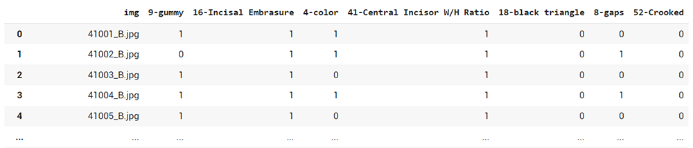
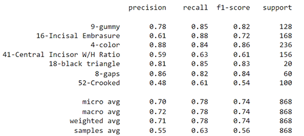

# Principles of Smile Design - Deep Learning Approach
This is a project for Biometrics course -SBE462- tackling the [21 principles of smile design](https://centerfordentalhealth.com/wp-content/uploads/2019/01/21-Principles-of-Smile-Design.pdf) as a multi-label classification problem using Deep Learning.


## _[DATASET](https://drive.google.com/drive/folders/15dE0dFRPq7mTZ8c-zVIag1TsFryztLD0)_


A total of **682** images of smiley faces and teeth -before and after- were collected belonging to **7** classes:
- Gummy Smile
- Incisal Embrasure
- Color
- Central Incisor W/H Ratio
- Black Triangle
- Gaps
- Crooked Teeth

After collecting at least **30** images for each class, the data was labeled according to the [dental_AI.ppt](https://docs.google.com/presentation/d/1GACdmOhz4q5GXNtHChhvm9ulD4B5ZWgA/edit#slide=id.p1) presenetation descibing the aesthetic issues for the mentioned 7 classes. ([csv link](https://docs.google.com/spreadsheets/d/1YaPpBtqj4uY9rEL9IHrajS_NhcxVBa25J1uie6wgkqc/edit?usp=sharing))




### *Data Augmentation*

We employed the data expansion pre-processing approach as the training data was not enough for the 7 classes, to increase the robustness of the model. The total resulting images were about **2500**. The augmentation techniques were as follows:
``` 
datagen = ImageDataGenerator(        
            rotation_range=30,      
            width_shift_range=0.2,  
            height_shift_range=0.2,    
            zoom_range=0.2,        
            horizontal_flip=True,
  ```


## VGG-16 Model with Transfer Learning

We used the same architecture as the VGG-16 baseline model (*ROC = 0.775, AUC = 0.787*) + transfer learning by loading pretrained weights from a face recognition task and fine-tuning.

> Added regularization and dropout layers in the classification layers of the model. We then trained the model on four ratios (*75:10:15, 60:15:25, 70:10:20 and 80:5:15*) for train, valid and test datasets and performed K-fold cross validation to ensure generalization.

## Performance

The performance of the model is determined by 4 different metrices:

 - Precision, which is the ratio between true predicted images to the false + true predicted.
 - Recall or Sensitivity, which is the ratio between the false negative predicted to all false images .
 - f1 score
 
  We also assess the classification ability of the model using the receiver operating characteristic ***ROC*** curves for each class, micro & macro averages and the area under the curve ***AUC***.

  > The best performance was obtained using *80:5:15* ratio with ***threshold = 0.55***

  Metrics:

  

  ROC:

  

  ### *Output Samples*:

  


# GUI
The interface offers the doctor uploading the image where it is displayed along with a table of predictions of any of the mentioned classes. It was made using `pyqt5 Qtcreator`. 


### Future Work
-----------------
- Weighted Loss
- Before & after prediction


-----------------

Team Members:
- Nouran Khaled
- Fatma Osama 
- Salma Haytham
- Aya Mohamed Abdulrazzaq
- Karin Amir 
- Moheb Ashraf 
